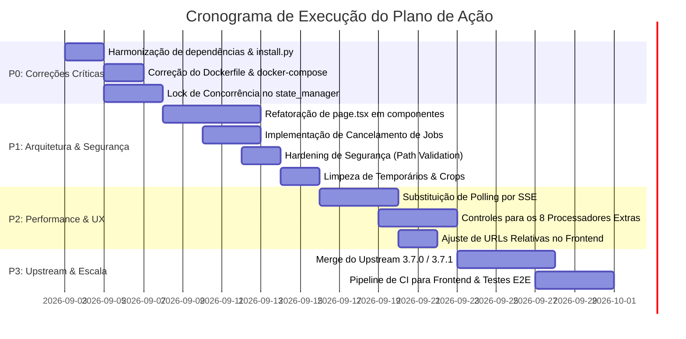

# Relatório Executivo: Análise SWOT & Plano de Ação Estratégico
**Projeto:** `faceYou` (FaceFusion Modernizado / Decoupled Fork)  
**Versão Atual:** `3.7.0-my.1` (Base Upstream: `3.6.1`)  
**Data:** 02 de Setembro de 2026  
**Autor:** Antigravity AI Pair Programmer  

---

## 1. Sumário Executivo

O projeto **faceYou** é um fork modernizado do motor open-source de ponta [FaceFusion](https://github.com/facefusion/facefusion). A principal inovação do fork é a **descontinuação da UI monolítica legada em Gradio** em prol de uma **arquitetura desacoplada cliente-servidor** composta por:
1. **Cockpit Web Moderno**: Desenvolvido em **Next.js 16 + React 19 + Tailwind CSS 4**, oferecendo uma experiência premium com glassmorphism, comparador deslizante de frames (Antes/Depois), mapeamento granular multi-source de faces e telemetria de hardware em tempo real.
2. **Backend FastAPI Assíncrono**: Um wrapper RESTful em torno do engine nativo, com descoberta dinâmica de portas, persistência em SQLite e background worker thread.
3. **Módulo de Workflows Tipado**: Abstrações padronizadas para pipelines `image_to_image` e `image_to_video`.

Apesar do salto substancial na experiência de usuário (UX) e do design moderno, a auditoria detalhada do código identificou **gargalos críticos de concorrência/thread-safety**, **inconsistências graves no pipeline de dependências e Docker**, **vulnerabilidades de segurança no tratamento de caminhos locais**, **débito técnico na componentização do frontend (arquivo único de ~2.440 linhas)** e **defasagem em relação ao upstream oficial (3.7.x)**.

Este documento consolida a matriz SWOT profunda do estado atual e estabelece um cronograma de ações categorizadas por criticidade (P0 a P3).

---

## 2. Matriz SWOT Detalhada

```
╔═════════════════════════════════════════════╦═════════════════════════════════════════════╗
║               STRENGTHS (S)                 ║               WEAKNESSES (W)                ║
║                 [Forças]                    ║                 [Fraquezas]                 ║
╠═════════════════════════════════════════════╬═════════════════════════════════════════════╣
║ • Arquitetura Desacoplada (Next.js/FastAPI) ║ • Anti-pattern frontend monólito (2.443 l.) ║
║ • UX Premium (Glassmorphism, Slider A/B)    ║ • Thread-safety nulo no state_manager       ║
║ • Suporte a Multi-Source Face Mapping       ║ • Inconsistência requirements.txt vs poetry ║
║ • Workflows tipados e modulares             ║ • Polling cego a cada 2s (sem SSE/WebSocket)║
║ • Fallback inteligente de portas livres     ║ • Falha no container Docker frontend        ║
║ • Anonimização de PII no export diagnóstico ║ • Ausência de testes no frontend            ║
║ • Resiliência no restart de jobs travados   ║ • Impossibilidade de cancelar jobs em curso ║
╠═════════════════════════════════════════════╬═════════════════════════════════════════════╣
║              OPPORTUNITIES (O)              ║                THREATS (T)                  ║
║               [Oportunidades]               ║                 [Ameaças]                   ║
╠═════════════════════════════════════════════╬═════════════════════════════════════════════╣
║ • Transição para WebSockets / Server Events ║ • Divergência acelerada do Upstream (3.7.x) ║
║ • Suporte real a filas distribuídas (Celery)║ • Race conditions corrompendo renders       ║
║ • Exposição controlada em rede local / Nuvem║ • Riscos de segurança / Local File Inclusion║
║ • Cobertura dos 8 processadores pendentes   ║ • Vazamento de disco por uploads e crops    ║
║ • Pipeline de CI completo (Frontend + E2E)  ║ • Incompatibilidade CUDA / ONNX Runtime     ║
╚═════════════════════════════════════════════╩═════════════════════════════════════════════╝
```

### 2.1. Strengths (Forças)

1. **Desacoplamento Arquitetural Real:**
   - A substituição do Gradio por uma API REST em FastAPI (`facefusion/api/`) isola a interface gráfica da execução de deep learning, eliminando travamentos de UI causados por blocking calls na thread principal.
2. **Experiência do Usuário (Cockpit Cockpit & Design System):**
   - Interface escura de alto padrão visual com glassmorphism, feedback tátil via toasts assíncronos, métricas em tempo real de GPU (nome, uso, temperatura) e um reprodutor de vídeo com comparador deslizante de frames (slider vertical interativo de alta precisão).
3. **Mapeamento Granular de Faces (Multi-Source Targeting):**
   - Capacidade de analisar todos os rostos do vídeo de destino (`/api/media/analyze-faces`), exibir thumbnails recortadas com bounding box, idade, gênero e raça, e permitir ao operador mapear individualmente qual foto de origem substituirá qual rosto específico.
4. **Workflows Padronizados:**
   - Módulos `image_to_image.py` e `image_to_video.py` bem estruturados sob o diretório `facefusion/workflows/`, centralizando medição percentual de progresso e manipulação de steps.
5. **Prevenção de Conflitos de Rede e Portas:**
   - O entrypoint `run_api.py` varre sockets sequencialmente (`find_free_port`) e injeta a URL ativa em `config.json` tanto em `public/` quanto em `out/`, viabilizando múltiplos containers ou execuções simultâneas sem colisões na porta 8000.
6. **Proteção de Privacidade (Sanitização de PII):**
   - O endpoint `/api/diagnostic/export` implementa mascaramento regex de caminhos locais (`/home/<user>` e `C:\Users\<user>`), evitando vazamento de dados sensíveis da estação do operador ao relatar bugs.
7. **Recuperação de Crash no Startup:**
   - O worker identifica automaticamente jobs que ficaram com status `processing` após um shutdown ou crash do sistema, marcando-os como `failed` com mensagem explicativa e impedindo travamento permanente da fila.

---

### 2.2. Weaknesses (Fraquezas)

1. **Monólito no Código do Frontend (`page.tsx` com 2.443 linhas):**
   - Todo o sistema de toasts, modal de análise de rostos, slider de comparação de vídeo, gerenciador de presets com `localStorage`, formulário de upload, abas de configuração e cards de jobs residem em um único componente com mais de 50 hooks `useState`. Isso viola princípios básicos de manutenibilidade, dificulta code review e torna a aplicação propensa a re-renderizações desnecessárias.
2. **Falta de Thread-Safety e Concorrência Global no Backend (`state_manager`):**
   - O motor FaceFusion foi concebido como um script CLI com um dicionário global de estado (`state_manager.STATE_SET['cli']`). No backend FastAPI, endpoints como `POST /preview`, `POST /config` e `POST /media/analyze-faces` alteram diretamente esse dicionário global sem nenhum mecanismo de lock (`threading.Lock`). Se um usuário solicitar um preview enquanto um vídeo longo está sendo renderizado pelo worker em background, as variáveis `source_paths`, `target_path` e `processors` da renderização em curso serão sobrescritas no meio da execução.
3. **Inconsistência Crítica de Dependências (`requirements.txt` vs `pyproject.toml`):**
   - `requirements.txt` lista apenas as dependências legadas do FaceFusion e **NÃO contém** `fastapi`, `uvicorn`, `sqlalchemy` ou `python-multipart`. Como o script oficial `install.py` lê `requirements.txt`, executar a instalação padrão quebra imediatamente a execução do backend (`run_api.py`).
4. **Docker Quebrado para o Frontend:**
   - `frontend/next.config.ts` está configurado com `output: "export"`. No entanto, `frontend/Dockerfile` roda `CMD ["npm", "run", "start"]`. No Next.js, `next start` falha categoricamente com exportações estáticas. O compose atual falha na inicialização do serviço `frontend`.
5. **Polling HTTP Fixo e Ineficiente:**
   - O frontend executa uma requisição `GET /api/jobs` a cada 2.000 ms via `setInterval` ininterrupto, mesmo quando a fila está vazia, o usuário está inativo ou a aba está minimizada. Não há reconexão exponencial, WebSockets ou Server-Sent Events (SSE).
6. **Ausência de Cancelamento de Jobs:**
   - Uma vez iniciado (`processing`), um job não pode ser interrompido nem pausado pela UI ou pela API. Se o operador enviar um vídeo de 2 horas por engano, a única forma de parar o processamento é matar o processo do servidor.
7. **Exclusão Insegura de Jobs (`DELETE /jobs/{job_id}`):**
   - A rota de deleção permite apagar registros e arquivos de saída mesmo se o job estiver no estado `processing`, levando a exceções não tratadas no worker.
8. **Cobertura de Testes Nula no Frontend:**
   - Nenhum teste unitário (Jest/Vitest) ou de ponta a ponta (Playwright/Cypress) foi configurado no diretório `frontend/`. No backend, os testes de API não rodam no CI por ausência das dependências FastAPI no workflow.

---

### 2.3. Opportunities (Oportunidades)

1. **Comunicação Bidirecional em Tempo Real via WebSocket ou SSE:**
   - Substituir o polling de 2 segundos por canais de streaming de eventos, permitindo atualização instantânea de porcentagem frame a frame, logs do console ao vivo e feedback imediato de finalização.
2. **Evolução para Filas Distribuídas Reais (Celery + Redis):**
   - As dependências `celery` e `redis` já constam em `pyproject.toml`, mas não foram ativadas. Habilitá-las permitiria paralelizar jobs em múltiplas GPUs ou máquinas remotas de forma profissional.
3. **Suporte Completo aos 11 Processadores Nativos:**
   - Atualmente, apenas 3 processadores (`face_swapper`, `face_enhancer`, `frame_enhancer`) possuem controles dedicados no cockpit. Expandir os controles para os 8 restantes (`deep_swapper`, `age_modifier`, `lip_syncer`, `face_editor`, `expression_restorer`, `frame_colorizer`, `background_remover`, `face_debugger`) transformará o cockpit em um estúdio completo de edição facial.
4. **Habilitação de Acesso Seguro em Rede Local (LAN / Cloud):**
   - Hoje o frontend fixa `http://localhost:{port}` via `config.json`. Ajustando para paths relativos (`/api`) ou detecção de `window.location.host`, o operador poderá rodar o servidor em uma workstation potente com GPU e operar a interface de qualquer tablet ou notebook na mesma rede.
5. **Modularização e Componentização do Frontend:**
   - Quebrar `page.tsx` em componentes atômicos (`VideoComparator`, `TargetFaceSelector`, `JobsList`, `SettingsTab`, `PresetsDropdown`, `ToastManager`) e hooks customizados (`useJobs`, `useHardwareTelemetry`, `usePresets`).
6. **Controle Granular de Filas (Pause, Resume, Prioridade, Cancelamento):**
   - Adicionar controle de prioridade e cancelamento graceful aproveitando `process_manager.stop()` do FaceFusion.

---

### 2.4. Threats (Ameaças)

1. **Divergência Severa do Upstream (`facefusion/facefusion`):**
   - O projeto base está nas versões `3.7.0` e `3.7.1`. O fork permanece na `3.6.1`. Quanto mais tempo passar sem a execução do playbook `UPSTREAM_MERGE.md`, maiores serão os conflitos de merge nos diretórios `facefusion/jobs/`, `processors/` e `choices.py`.
2. **Corrupção de Inferência por Concorrência:**
   - Em cenários multi-aba ou uso intenso, requisições concorrentes de preview e análise de face colidem no estado global e causam falhas silenciosas ou trocas incorretas de rostos.
3. **Vulnerabilidade de Local File Inclusion / Leitura Arbitrária:**
   - `POST /jobs` e `POST /preview` aceitam caminhos absolutos do host diretamente se a string não começar com `/api/media/upload/`. Isso possibilita a leitura e processamento de arquivos arbitrários do sistema de arquivos da máquina.
4. **Vazamento e Esgotamento de Armazenamento em Disco:**
   - A cada chamada de `/api/media/analyze-faces`, novas imagens JPEG recortadas (`crop_*.jpg`) são gravadas na pasta de uploads. O endpoint de exportação de diagnóstico cria arquivos `.zip` em `/tmp` com `delete=False` que nunca são expurgados. Em uso prolongado, o disco do sistema atinge 100%.
5. **Incompatibilidade de Drivers e CUDA no Docker:**
   - O `Dockerfile` fixa `onnxruntime-gpu==1.16.3` sobre CUDA 11.8, enquanto o ecossistema Python local e o instalador usam ONNX Runtime `1.24.4`. Isso pode causar falhas imediatas de compilação de grafo ONNX em placas RTX série 40 e 50.

---

## 3. Relatório Detalhado de Ações & Roadmap Técnico

As ações abaixo foram estruturadas em 4 níveis de prioridade:
- **P0 (Crítico / Bloqueante):** Erros de execução, falhas de concorrência, dependências quebradas e falhas em containers.
- **P1 (Alto):** Arquitetura, refatoração de código, cancelamento de jobs e segurança.
- **P2 (Médio):** Otimizações de rede, streaming em tempo real e novos processadores no cockpit.
- **P3 (Baixo / Evolutivo):** Sincronização com upstream 3.7.x e suporte distribuído multi-GPU.



---

### 3.1. Ações de Prioridade P0 (Crítico / Imediato)

#### AÇÃO P0-1: Harmonização de Dependências e Correção do `install.py`
- **Problema:** `requirements.txt` não inclui as dependências essenciais da API (`fastapi`, `uvicorn`, `sqlalchemy`, `python-multipart`). Executar `python install.py` deixa o ambiente incapaz de iniciar `run_api.py`.
- **Causa Raiz:** O fork adicionou as dependências apenas em `pyproject.toml`, mas o script `installer.py` faz parsing de `requirements.txt`.
- **Passos de Implementação:**
  1. Atualizar `requirements.txt` incluindo:
     ```text
     fastapi>=0.110.0
     uvicorn[standard]>=0.28.0
     sqlalchemy>=2.0.28
     python-multipart>=0.0.9
     ```
  2. Limpar referências mortas a `celery` e `redis` de `pyproject.toml` ou documentar explicitamente como dependências opcionais (`extras`).
  3. Atualizar `.github/workflows/ci.yml` para garantir que o job de teste execute com o conjunto completo de dependências.
- **Critério de Aceite:** `python install.py --onnxruntime default --skip-conda && python run_api.py` inicializa sem nenhum `ModuleNotFoundError`.

#### AÇÃO P0-2: Correção do Ambiente Docker e Docker Compose
- **Problema:** O frontend falha ao rodar `npm run start` dentro do container Alpine porque o build é puramente estático (`output: "export"`). Além disso, o Dockerfile do backend não constrói o frontend e usa versões divergentes do ONNX Runtime.
- **Passos de Implementação:**
  1. **Backend Dockerfile:**
     - Atualizar a versão do `onnxruntime-gpu` para corresponder ao release do projeto (`1.24.4` com CUDA 12.x ou compatível).
     - Alterar o comando de execução no container para `CMD ["python", "run_api.py"]` (evitando recarregamento com `reload=True` de desenvolvimento).
  2. **Frontend Dockerfile:**
     - Como o frontend gera uma pasta estática `out/`, o stage de runner deve utilizar um servidor estático ultraleve (`nginx:alpine` ou `caddy:alpine` ou pacote `serve`), ou ser montado diretamente no backend FastAPI para execução em container único (Multi-stage Build consolidado).
  3. **Multi-stage Unificado Recomendado:**
     - No `Dockerfile` raiz, primeiro compilar o Next.js em um stage Node.js, copiar o resultado de `out/` para `/app/frontend/out` dentro do stage Python, e expor apenas a porta do FastAPI (porta única servindo estáticos e API).
- **Critério de Aceite:** `docker compose up --build` sobe sem erros e a interface carrega perfeitamente no navegador em `http://localhost:8000`.

#### AÇÃO P0-3: Isolamento de Concorrência e Thread-Safety no `state_manager`
- **Problema:** Chamadas de `POST /preview`, `POST /media/analyze-faces` e `POST /config` alteram `state_manager.set_item(...)` em tempo real, colidindo com jobs sendo executados pelo background worker.
- **Passos de Implementação:**
  1. Criar um context manager thread-safe para operações efêmeras em `facefusion/state_manager.py`:
     ```python
     import threading
     from contextlib import contextmanager

     _STATE_LOCK = threading.RLock()

     @contextmanager
     def temporary_state(overrides: dict):
         with _STATE_LOCK:
             original = {k: get_item(k) for k in overrides}
             try:
                 for k, v in overrides.items():
                     set_item(k, v)
                 yield
             finally:
                 for k, v in original.items():
                     set_item(k, v)
     ```
  2. Nos endpoints `/preview` e `/media/analyze-faces`, envelopar a extração e o processamento de frames dentro de `with temporary_state({...}):`.
  3. Adicionar trava de execução para impedir que previews concorrentes acessem a memória de inferência da GPU enquanto o worker principal executa frames críticos.
- **Critério de Aceite:** Disparar 5 requisições concorrentes de preview durante a renderização de um job de vídeo longo não altera os parâmetros nem o resultado do job em execução.

---

### 3.2. Ações de Prioridade P1 (Arquitetura & Segurança)

#### AÇÃO P1-1: Decomposição Modular do Frontend (`page.tsx`)
- **Problema:** Um arquivo com 2.443 linhas contendo toda a aplicação viola as boas práticas de engenharia de software e padrões de design Next.js.
- **Estrutura Modular Alvo:**
  ```
  frontend/src/
  ├── components/
  │   ├── common/
  │   │   ├── ToastContainer.tsx
  │   │   ├── Header.tsx
  │   │   └── Sidebar.tsx
  │   ├── cockpit/
  │   │   ├── SourceMediaUploader.tsx
  │   │   ├── TargetMediaViewer.tsx
  │   │   ├── FaceMappingModal.tsx
  │   │   ├── ProcessingSettingsPanel.tsx
  │   │   └── VideoComparator.tsx
  │   ├── jobs/
  │   │   ├── JobCard.tsx
  │   │   └── JobsDashboard.tsx
  │   └── settings/
  │       ├── HardwareInfoCard.tsx
  │       └── SystemConfigForm.tsx
  ├── hooks/
  │   ├── useJobs.ts
  │   ├── useHardware.ts
  │   ├── useFaceAnalysis.ts
  │   └── usePresets.ts
  └── app/
      ├── page.tsx (apenas layout orquestrador < 150 linhas)
  ```
- **Critério de Aceite:** `page.tsx` reduzido para menos de 200 linhas; todos os módulos isolados e com tipagens TypeScript estritas sem erros de lint (`npm run lint`).

#### AÇÃO P1-2: Mecanismo de Cancelamento e Interrupção de Jobs
- **Problema:** Impossível parar uma tarefa em andamento.
- **Passos de Implementação:**
  1. Adicionar endpoint `POST /api/jobs/{job_id}/cancel`.
  2. Integrar com o `process_manager.stop()` do FaceFusion.
  3. No `worker.py`, checar periodicamente se o job atual teve solicitação de cancelamento:
     - Atualizar status no SQLite para `failed` com mensagem `"Cancelado pelo usuário"`.
     - Fazer limpeza dos arquivos temporários de frames parciais.
  4. Na rota `DELETE /api/jobs/{job_id}`, verificar se `job.status == 'processing'`. Se for o caso, disparar cancelamento prévio antes de deletar registros.
  5. Adicionar botão "Cancelar" com ícone de stop nos cards de job na UI.
- **Critério de Aceite:** Clicar em "Cancelar" em um job em processamento interrompe a inferência em até 3 segundos e restaura os recursos de CPU/GPU.

#### AÇÃO P1-3: Sanitização Estrita de Caminhos (Proteção contra Path Traversal e Arbitrary Access)
- **Problema:** Parâmetros `source_paths` e `target_path` aceitam qualquer path arbitrário local. Validação de saída usa `startswith()` frágil.
- **Passos de Implementação:**
  1. Criar função utilitária de resolução segura com `os.path.commonpath`:
     ```python
     def validate_safe_path(target_path: str, allowed_base_dir: str) -> str:
         abs_target = os.path.abspath(target_path)
         abs_base = os.path.abspath(allowed_base_dir)
         if os.path.commonpath([abs_target, abs_base]) != abs_base:
             raise HTTPException(status_code=400, detail="Acesso a diretório não autorizado.")
         return abs_target
     ```
  2. Restringir entradas de upload estritamente aos diretórios autorizados (`uploads_dir` e caminhos configurados em `jobs_path`).
  3. Higienização no download de diagnóstico: adicionar background task no FastAPI (`BackgroundTasks`) para deletar o arquivo zip temporário imediatamente após a conclusão do envio HTTP da resposta (`FileResponse`).
- **Critério de Aceite:** Tentativas de envio de `/etc/passwd` ou `../../` retornam HTTP 400. Arquivos `.zip` temporários não acumulam na pasta `/tmp`.

#### AÇÃO P1-4: Gestão e Limpeza de Lixo de Disco (Garbage Collection de Uploads/Crops)
- **Problema:** Cada chamada a `/api/media/analyze-faces` grava arquivos `crop_*.jpg` que nunca são removidos.
- **Passos de Implementação:**
  1. Salvar crops em diretório efêmero `jobs_path/temp_crops/`.
  2. Implementar rotina de expurgo automático para arquivos de visualização temporária com mais de 24 horas de criação.
  3. Adicionar botão "Limpar Cache Temporário" na aba de Configurações da UI.
- **Critério de Aceite:** Crops e previews antigos são expurgados sem impactar jobs ativos.

---

### 3.3. Ações de Prioridade P2 (Performance & Experiência de Uso)

#### AÇÃO P2-1: Substituição de Polling HTTP por Server-Sent Events (SSE)
- **Problema:** `setInterval` a cada 2s sobrecarrega o servidor e o browser.
- **Passos de Implementação:**
  1. Criar rota SSE no FastAPI: `GET /api/jobs/stream`.
  2. Implementar um despachante de eventos simples (`asyncio.Queue`) que emite dados apenas quando o worker atualiza o progresso ou status do job.
  3. No frontend, utilizar a API nativa `EventSource` no hook `useJobs`:
     - Atualização instantânea com zero latência perceptível.
     - Fallback gracioso para polling longo caso SSE seja bloqueado por proxy reverso.
- **Critério de Aceite:** O tráfego de requisições de rede em repouso cai a zero e a barra de progresso avança suavemente em tempo real.

#### AÇÃO P2-2: Expansão do Cockpit para os 8 Processadores Restantes
- **Problema:** Usuários não conseguem configurar parâmetros dos módulos `age_modifier`, `lip_syncer`, `face_editor`, `expression_restorer`, etc. pela interface moderna.
- **Passos de Implementação:**
  1. Criar componentes colapsáveis dedicados no painel lateral de processamento para cada processador ativo:
     - `AgeModifier`: Slider de direção de idade (-100 a +100).
     - `FaceEditor`: Sliders de sorriso, abertura de olhos, direção de olhar e rotação de cabeça (pitch/yaw/roll).
     - `LipSyncer`: Seleção de áudio de referência e peso do sincronismo labial.
     - `ExpressionRestorer`: Fator de restauração de expressão e áreas faciais.
  2. Atualizar o payload de `POST /jobs` e `POST /preview` para aceitar os argumentos correspondentes.
- **Critério de Aceite:** Ativar `face_editor` na lista de processadores renderiza imediatamente seus controles e os parâmetros são refletidos no resultado do frame processado.

#### AÇÃO P2-3: Suporte a Rede Local e Desacoplamento de Hostname
- **Problema:** `config.json` grava `http://localhost:{port}`, impedindo acesso de outros dispositivos na rede local (LAN).
- **Passos de Implementação:**
  1. No frontend, caso `apiUrl` não esteja definido ou seja `localhost`, utilizar caminhos relativos (`/api/...`) quando a página for servida na mesma origem, ou usar `window.location.hostname` com a porta descoberta.
  2. No `run_api.py`, permitir o bind em `0.0.0.0` mediante parâmetro `--listen-all` ou variável de ambiente `FACEFUSION_HOST=0.0.0.0`.
- **Critério de Aceite:** Acessar a aplicação a partir de outro computador na rede (`http://192.168.x.x:8000`) permite visualização, uploads e processamento completo sem erros de CORS ou chamadas para o localhost do cliente.

---

### 3.4. Ações de Prioridade P3 (Alinhamento Upstream & Escala)

#### AÇÃO P3-1: Execução do Playbook de Sincronização com Upstream (3.7.0 e 3.7.1)
- **Problema:** O fork está defasado em relação aos novos modelos e otimizações lançados no upstream oficial.
- **Passos de Implementação:**
  1. Configurar o remote upstream:
     ```bash
     git remote add upstream https://github.com/facefusion/facefusion.git
     git fetch upstream --tags
     ```
  2. Criar branch `merge/upstream-3.7.0` a partir da tag `3.7.0-my.1`.
  3. Realizar merge resolvendo conflitos especialmente em:
     - `facefusion/choices.py` (manter validações de pre-check do fork).
     - `facefusion/jobs/` (preservar separação modular do fork).
  4. Rodar a suíte completa de testes de regressão do CLI e da API.
  5. Gerar tag `3.7.0-my.2` ou `3.7.1-my.1`.
- **Critério de Aceite:** Repositório atualizado com todas as correções do upstream sem perda das 16 funcionalidades proprietárias do fork.

#### AÇÃO P3-2: Pipeline de Integração Contínua (CI) e Testes E2E
- **Problema:** CI atual ignora o frontend e quebra por falta de dependências.
- **Passos de Implementação:**
  1. Configurar job no GitHub Actions com matriz para Node.js 20 e Python 3.10/3.12.
  2. Adicionar steps:
     - `npm run lint` e `npm run build` na pasta `frontend/`.
     - Execução de testes de API com `pytest tests/test_api_*.py`.
     - Teste de smoke E2E usando Playwright headless simulando submissão de job.
  3. Higienizar histórico do Git: emendar o commit `a2c12e3` cujo commit message vazou um prompt de LLM.
- **Critério de Aceite:** Todos os Pull Requests passam por validação automatizada de código Python e TypeScript antes de permitir o merge.

---

## 4. Quadro Resumo de Prioridades e Estimativa de Esforço

| ID | Ação | Categoria | Prioridade | Esforço Estimado | Impacto |
|---|---|---|---|---|---|
| **P0-1** | Harmonizar `requirements.txt` e `install.py` | DevOps / Setup | **P0 (Crítico)** | 2 horas | Alto (Destrava setup local) |
| **P0-2** | Corrigir Dockerfile e Docker Compose | DevOps / Deploy | **P0 (Crítico)** | 4 horas | Alto (Habilita containers) |
| **P0-3** | Concorrência e Lock no `state_manager` | Backend / Engine | **P0 (Crítico)** | 6 horas | Crítico (Elimina race conditions) |
| **P1-1** | Refatorar `page.tsx` em componentes atômicos | Frontend / UX | **P1 (Alto)** | 12 horas | Alto (Manutenibilidade do código) |
| **P1-2** | Implementar cancelamento de jobs em curso | Backend / API | **P1 (Alto)** | 6 horas | Alto (Controle de recursos de hardware) |
| **P1-3** | Validação de segurança em caminhos (LFI/Traversal) | Segurança | **P1 (Alto)** | 4 horas | Crítico (Prevenção de brechas) |
| **P1-4** | Limpeza de crops e zips temporários | Infra / Disco | **P1 (Alto)** | 3 horas | Médio (Evita disco cheio) |
| **P2-1** | Implementar Server-Sent Events (SSE) | Backend / Frontend | **P2 (Médio)** | 6 horas | Alto (Experiência fluida em tempo real) |
| **P2-2** | Adicionar controles para os 8 processadores restantes | Frontend / UI | **P2 (Médio)** | 8 horas | Alto (Paridade total com motor) |
| **P2-3** | Suporte a LAN e URLs relativas no frontend | Redes / UX | **P2 (Médio)** | 3 horas | Médio (Flexibilidade de operação) |
| **P3-1** | Merge com Upstream 3.7.0 e 3.7.1 | Manutenção | **P3 (Evolutivo)**| 10 horas | Alto (Sincronização de novos modelos) |
| **P3-2** | Pipeline CI completo (Frontend + Backend E2E) | Qualidade / CI | **P3 (Evolutivo)**| 6 horas | Médio (Confiabilidade de releases) |

---

## 5. Conclusão e Próximos Passos Recomendados

O fork **faceYou** demonstrou um avanço de produto de altíssimo valor: transformar o FaceFusion de uma ferramenta técnica de linha de comando/Gradio para uma aplicação web moderna com experiência comparável a softwares comerciais de ponta.

Para consolidar essa vantagem competitiva e transformar o protótipo funcional em uma plataforma estável de produção, a recomendação prioritária é:
1. **Executar imediatamente o Sprint P0** (Harmonização de dependências, Docker unificado e trava de concorrência).
2. **Executar o Sprint P1** (Decomposição do `page.tsx` e cancelamento de jobs).

Este plano garante que a aplicação não apenas atenda aos critérios visuais do PRD, mas opere com a robustez e a segurança necessárias para processamento intensivo de inteligência artificial.
